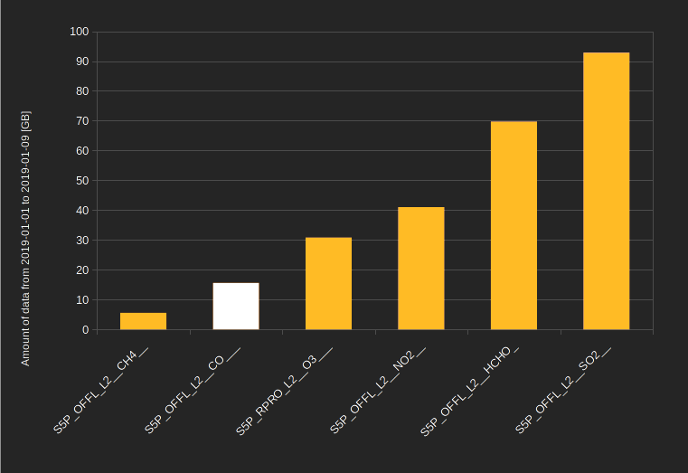
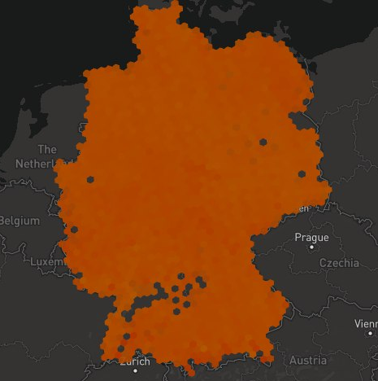

From Prototype to Service
=========================

_The prototype is done.
What's next?
What did we learn?_

Starting with the simple idea that it's too hard to access satellite-based emission data,
since September 2019, we were trying to get our heads around the amount of data available,
always trying to find ways to make this data easily accessible.

With the official end of our Prototypefund project nearing, here is a summary of
what we have learned, where we are and how we want to continue.

Current State
-------------

Here are a few facts about the current status of Emissions API (Feb 25, 2020):

- Available product: **Carbon monoxide**
- Available measurements: **~1.7 billion points**
- Available area: **Earth**
- Available timespan: **January 2019 to present** (new data imported every 3 hours)
- Database size: **~0.5 TB**
- Hosted on: **Amazon Web Services (AWS)**

What is the data good for?
--------------------------

When talking about the project, a lot of people ask if they can get local data for the street they live in or the building they work in,
comparing the data to ground-based, high-frequency sensor data from projects like [sensor.community](https://sensor.community) or [openSenseMap](https://opensensemap.org).
They expect the difference to be just that satellite data has a coverage of the whole world.
But the data is quite different. Measurements are for the column of air between an approximately 7×7km² ground area and the satellite.
Hence, emissions can originate from two blocks away and never reach your home or can be in the air, high above the ground.

A second important fact to know is that with a few exceptions, we only get a single measurement per day for each location on the world
and that measurement is always taken around noon local time.
So, for instance, no measurements for the morning rush-hour.

This means that the data is not very useful for things like determining the emissions you are exposed to.
Nevertheless, the data can be used to determine large-scale trends on a global, continental or country scale.
This is still very useful but certainly a limitation.

Why do we put this information in front of our roadmap?
This knowledge is what we based our plans on.
So, in general, keep in mind:

- _Satellite-based emissions data is great for detecting global trends_
- _Satellite-based emissions data will not give you local information about your home_

For more information about the data,
take a look at our [data guide](data.md) were we provide an more detailed description on the strengths and limitations of the data.
how the data aggregation works
and what makes it different from ground-based data measurements.

Problems Based on the Amount of Data
------------------------------------

One thing we noticed pretty fast is the huge amount of data we had.
We planned to support multiple emission types and be pretty fast about it so that people can request whatever area they want to request.
Unfortunately, the reality is that this is way too much data to handle all at once.

Pretty early, we therefore decided to drop additional information, not store low-quality data and only support the most interesting products.
But not long after we noticed that carbon monoxide, the product we started with, was one of the smaller products
and adding more products would be a larger problem than expected.
The reasons for different sizes vary from having more or less valid measurements to having separate data for different heights of the air column.

We were already dealing with an approximately 0.5 TB database for just carbon monoxide over a year
and the following graph shows the relation of source data size for different products.

Storing a multi-terabyte database per year would be hard for a non-funded project.
And that is just ignoring the performance implication of users being able to live query, search through and aggregate this data.

So we needed something different, and while finishing the prototype for the original idea, we secretly started with a new plan…
well… we did that publicly on GitHub.

Roadmap for the Future
----------------------

Having talked about both the problems as well as what the data is most useful for,
we decided we will discontinue the current form of the API,
going for a set of reduced and/or preprocessed data instead.
In general, we will keep the current REST endpoints though,
hopefully making integrations easy to adapt.

This will degrade the local accuracy even further
but remember that the satellite-based emissions data are not very useful for local concerns in any case.
The advantage of this is having fewer data and faster access.

The data reduction happens by mapping the measurements to a [Hexagonal Hierarchical Spatial Index](https://eng.uber.com/h3/).
That way, we will be able to control the amount of data and the accuracy by controlling the size of the hexagons
to which the data is mapped.

How will this look like? Here is an example, showing data for Germany using an H3 raster size of 5:

_–Osnabrück, Feb 25, 2020_
